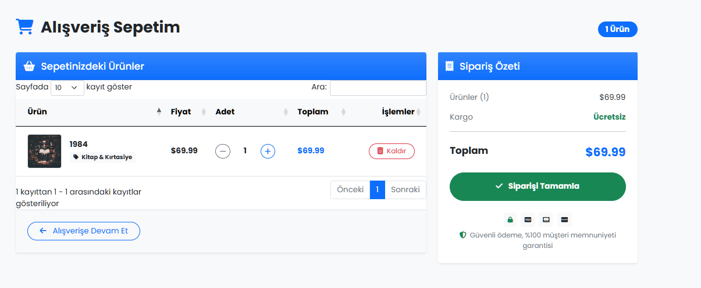
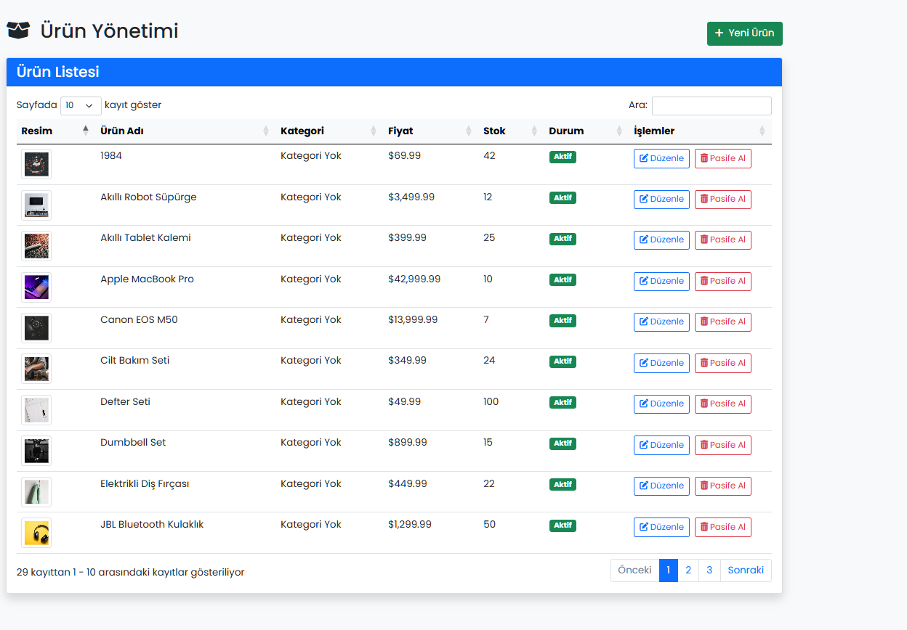

# ETicaret - ASP.NET Core E-Ticaret Projesi

Bu proje, ASP.NET Core ile geliştirilmiş tam kapsamlı bir e-ticaret uygulamasıdır. Kullanıcılar için ürün listeleme, sepet yönetimi, sipariş verme, hesap yönetimi gibi temel e-ticaret fonksiyonlarını içerir.

## Proje Yapısı

Proje, N-Tier (Çok Katmanlı) mimari üzerine kurulmuştur:

- **ETicaretUI**: Kullanıcı arayüzü (MVC)
- **Business**: İş mantığı katmanı
- **Dal**: Veri erişim katmanı
- **Data**: Veri modelleri ve veritabanı bağlantısı

## Özellikler

- **Ürün Kataloğu**: Kategori filtreleme, fiyat aralığı filtreleme, arama, sıralama ve sayfalama
- **Sepet Yönetimi**: Ürün ekleme, silme, miktar güncelleme
- **Sipariş Yönetimi**: Siparişleri oluşturma ve takip etme
- **Kullanıcı Hesapları**: Kayıt olma, giriş yapma, profil düzenleme
- **Rol Bazlı Yetkilendirme**: Admin ve standart kullanıcı rolleri
- **Adres Yönetimi**: Kullanıcının adres bilgilerini kaydetme ve yönetme

## Kullanıcı Rolleri ve Yetkiler

### Standart Kullanıcı
- Ürünleri görüntüleme ve filtreleme
- Sepete ürün ekleme ve yönetme
- Sipariş oluşturma ve sipariş geçmişini görüntüleme
- Kişisel profil ve adres bilgilerini düzenleme
- Şifre değiştirme ve hesap ayarlarını yönetme

### Admin Kullanıcısı
- Tüm standart kullanıcı yetkilerine sahiptir
- Ürün ekleme, düzenleme ve silme
- Kategori ekleme, düzenleme ve silme
- Kullanıcı hesaplarını yönetme
- Kullanıcı rollerini düzenleme
- Tüm siparişleri görüntüleme ve sipariş durumlarını güncelleme
- Site genelinde istatistikleri görüntüleme

## Giriş Bilgileri

Sistem ilk kurulduğunda SeedData ile oluşturulan iki temel kullanıcı bulunmaktadır:

### Admin Kullanıcısı
- **Kullanıcı adı**: `admin`
- **E-posta**: `admin@example.com`
- **Şifre**: `admin123`

### Normal Kullanıcı
- **Kullanıcı adı**: `normal`
- **E-posta**: `normal@example.com`
- **Şifre**: `normal123`

Sisteme giriş yaparken kullanıcı adı veya e-posta kullanabilirsiniz.

## Sistem Özellikleri

### Admin Paneli Özellikleri

Admin paneline giriş yaptıktan sonra:
1. Sol menüden istediğiniz yönetim sayfasına erişebilirsiniz
2. Ürün yönetimi ile:
   - Yeni ürünler ekleyebilir
   - Mevcut ürünleri düzenleyebilir
   - Ürün resimlerini yükleyebilir
   - Ürünleri silebilir veya pasife alabilirsiniz
3. Kategori yönetimi sayfasından:
   - Yeni kategoriler ekleyebilir
   - Mevcut kategorileri düzenleyebilir
   - Kategorileri silebilirsiniz
4. Kullanıcı yönetimi sayfasından:
   - Tüm kullanıcıları listeleyebilir
   - Kullanıcı rollerini değiştirebilir
   - Kullanıcıları aktif/pasif yapabilirsiniz
5. Sipariş yönetimi sayfasından:
   - Tüm siparişleri görüntüleyebilir
   - Sipariş durumlarını güncelleyebilirsiniz

### Müşteri Özellikleri

Normal kullanıcı olarak:
1. Ürünleri kategorilere göre filtreleyebilir
2. Fiyat aralığına göre ürün arayabilir
3. Ürünleri sepete ekleyebilir
4. Sepet içeriğini düzenleyebilir
5. Sipariş verebilir
6. Sipariş geçmişini görüntüleyebilir
7. Adres bilgilerinizi yönetebilir
8. Profilinizi düzenleyebilir ve şifrenizi değiştirebilirsiniz

## Teknolojiler

- **ASP.NET Core MVC**: Web arayüzü
- **Entity Framework Core**: ORM aracı
- **ASP.NET Core Identity**: Kimlik doğrulama ve yetkilendirme
- **Bootstrap**: Responsive ön yüz tasarımı
- **SQL Server**: Veritabanı

## Kurulum

1. Projeyi klonlayın
   ```
   git clone https://github.com/username/ETicaret-Bitirme.git
   ```

2. Veritabanını oluşturun
   ```
   dotnet ef database update
   ```

3. Projeyi çalıştırın
   ```
   dotnet run --project ETicaretUI
   ```


## Veritabanı Modeli

Proje aşağıdaki ana varlık modellerini içerir:

- **Product**: Ürün bilgileri
- **Category**: Ürün kategorileri
- **Cart/CartItem**: Sepet ve sepet öğeleri
- **Order/OrderLine**: Sipariş ve sipariş detayları
- **Address**: Kullanıcı adresleri
- **AppUser/AppRole**: Kullanıcı ve rol bilgileri

## Örnek Ekran Görüntüleri

### Anasayfa ve Ürün Listesi


### Ürün Detay Sayfası


### Sepet Sayfası


### Admin Panelinden Bir örnek


## Geliştirme Süreci

Bu proje ASP.NET Core MVC kullanılarak geliştirilmiştir. Veritabanı olarak SQL Server kullanılmış ve Entity Framework Core ile ORM sağlanmıştır. Ön yüz Bootstrap 5 ile tasarlanmıştır. Identity yapısı kullanılarak kullanıcı yönetimi ve rol bazlı yetkilendirme sağlanmıştır.

## Katkıda Bulunma

1. Projeyi fork edin
2. Feature branch oluşturun (`git checkout -b feature/amazing-feature`)
3. Değişikliklerinizi commit edin (`git commit -m 'Add some amazing feature'`)
4. Branch'inizi push edin (`git push origin feature/amazing-feature`)
5. Pull Request oluşturun

## Lisans

Bu proje [MIT Lisansı](LICENSE) altında lisanslanmıştır. 